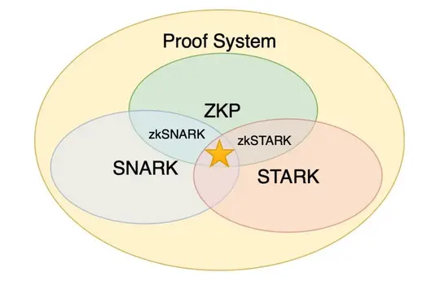

# 零知识证明 Zero-Knowledge Proof 学习

## 概念

> 它指的是证明者能够在不向验证者提供任何有用的信息的情况下，使验证者相信某个论断是正确的。

零知识证明实质上是一种涉及两方或更多方的协议，即两方或更多方完成一项任务所需采取的一系列步骤。证明者向验证者证明并使其相信自己知道或拥有某一消息，但证明过程不能向验证者泄漏任何关于被证明消息的信息。

## SNARK 和 STARK

> 区块链领域中所用到或者提到的 “zk” 通常不是真正的零知识证明, 而经常是 Validity Proof

## 项目

- 虚拟机
  - zkEVM
  - zkSync
- 交易隐私
  - Tornado.cash
  - zk.money

## RoadMap

- [ ] 科普-[了解什么是零知识证明](https://github.com/Confucian-e/ZK-Learn/tree/main/what_is_zk)
- [ ] 学习-[零知识证明的相关理论](https://github.com/Confucian-e/ZK-Learn/tree/main/learn_zk)
- [ ] 应用-哪些项目采用了零知识证明
- [ ] 分析-项目采用零知识证明解决了哪些问题

