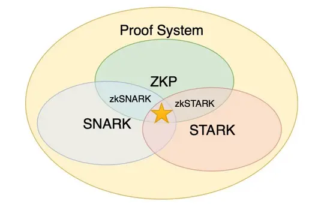

# 零知识证明相关理论

## 逻辑框架

## 常见的算法

> 区块链领域中所用到或者提到的 “zk” 通常不是真正的零知识证明, 而经常是 Validity Proof

### zk-SNARK

#### 概念

**z**ero-**k**nowledge **S**uccint **N**on-interactive **AR**guments of **K**nowledge 简洁的非交互式知识认证

- **S**uccinct：证明的数据量比较小
- **N**on-interactive：没有或者只有很少交互
- **AR**guments：验证者只对计算能力有限的证明者有效。拥有足够计算能力的证明者可以伪造证明。这也叫“计算可靠性"（相对的还有”完美可靠性"）
- of **K**nowledge：对于证明者来说在不知道证据（**Witness**，比如一个哈希函数的输入或者一个确定 Merkle-tree 节点的路径）的情况下，构造出一组参数和证明是不可能的

#### 流程

在区块链中zk-snarks是指可以为生成特定输出的计算提供相应的proof证明，使得验证proof的速度远远高于执行相应计算的速度，对于SNARK使用的变换，在语句被表述为函数之后，遵循下图的一般模式，即原始计算，代数电路，秩为1的约束系统，二次算数程序，线性PCP，线互式证明，最后生成零知识证明。

要生成 zk-snarks，您需要一个电路。电路类似于具有公共输入和输出以及私有输入的小程序。这些私人输入是您不为验证而透露的知识，这就是为什么它被称为零知识证明。使用 zk-snarks，我们可以证明输出可以从给定电路的输入中产生。

### Zk-STARK