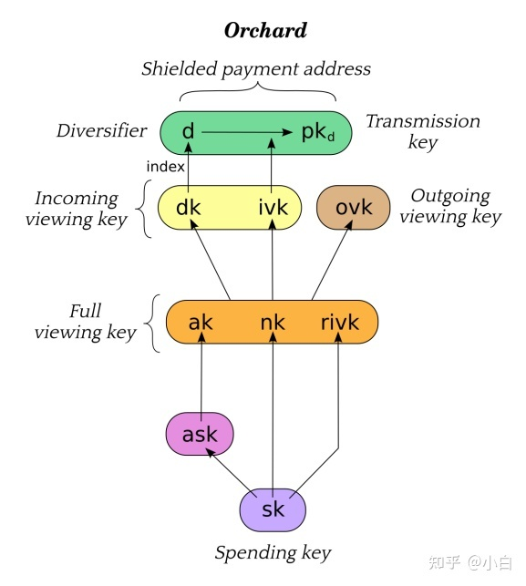

# 采用零知识证明的项目

## 交易隐私

### Tornado cash 混币器

算法：zk-SNARKs

#### 背景

Tornado cash 是一个去中心化**加密货币混合**服务平台，使用智能合约来接受来自一个地址的代币存款，并允许他们从另一个地址提款。这些智能合约作为混合所有已存资产的池。一旦资金通过一个全新的地址从这些池中提取，链上源和目的地之间的链接已断开。然后将提取的加密资产匿名化。tornado cash 中通过将 **merkle tree** 与 **zk-snarks** 结合使用实现存取款地址分离，从而实现匿名传送代币。

#### 使用

Tornado cash 允许你将固定金额的 ETH、DAI、USDC、USDT 存入合约。存款时会得到一个备份代码，用于以后提取资金。

- 为什么用固定金额？

固定金额容易混入更大匿名集。如图有426份 0.1 ETH 的存款，你存入 0.1 ETH 后就成为了427分之一。

- 如何保障安全（不被追踪）？

安全性取决于你所处匿名集的大小和存提款频率。匿名集越大，存提款越频繁越安全。如果你有一个30,000人的集合，但几个月没有存款/提款。现在你来存款，等了一天又取款，要追踪资金到你身上将是非常容易的。

#### 技术

**对merkle tree的使用：**

主要用于存取款操作，进行存款操作时会创建两个随机数，将这两个随机数通过 `Pedersen` 哈希处理后生成一个字符串 `commitment`，将此字符串作为叶子节点插入默克尔树中，计算出 merkle 根的值后将 merkle 根返回给用户，作为之后取款时的验证凭证。

tornado cash 中的 merkle tree 是一颗二叉树，阅读其代码可知，re-hashing 操作的次数控制在 log(n) 以内，当原始树中叶子节点个数是奇数时插入后的树没有孤儿，原始树中叶子节点个数时偶数时插入后的树有孤儿，孤儿在第一个数据块。

如下图所示，原始树中有两个叶子节点 a，b，当插入新节点 c 时，判断叶子节点个数，为偶数，c 与0值进行 hash 计算得到 `Hc`，叶子节点个数除2，得到叶子节点的父节点个数1，判断节点个数为奇数，将 `Hc` 与 `Hab` 连接并计算 hash 值 `Habc` ，此时 `Habc` 为这颗 merkle 树的根，用户将这个根保存作为之后取款的凭证。

**对zk-snarks的使用：**

tornado cash 中取款操作需要用户提供一个 note，如下图

这个 note 是由 `secret` 与 `nullifier` 通过 zk-snarks 电路在链下计算生成的，`secret` 与 `nullifer` 是在链下随机生成的31字节长度的随机数。

tornado 中，存款操作传入的参数 `commitment` 是由 `secert` 与 `nullifer` 串联产生一个62字节的数，通过`Pedersen` 哈希处理，生成的输出表示 `Baby Jubjub` 椭圆曲线的一个元素，编码为 32 字节大端整数。之后将 `commitment` 插入 merkle 树中得到 `merkle root`。

在 tornado cash 中，取款操作时需要输入三个值，分别是 `proof`，`root`，`nulifierHash`，`proof` 为存款时在链下计算出的 note 值，`root` 为存款时获得的 merkle root，`nulifierHash` 为生成的随机数。

`nulifierHash`作用是为了防止已经使用过的 note 再次使用，在进行证明 `proof` 之前，先确定传入的 `root` 值是否在 merkle 树中，之后验证 `proof` 是否正确，通过电路计算出一个 `root`，将计算出的 `root` 与取款时输入的 `root` 比较是否一样，一样的话，将 `nullifierHash` 记录为 true，证明我们已经领过款。

#### 总结

tornado cash 中将 merkle tree 运用到零知识证明中，零知识证明中 `proof` 实际捆绑了凭证 note，用户自己的 `merkle root`，`nullifierHash`，资金接收者地址。取款合约中确保 `nullilierHash` 是未使用过的，以及用户提供的 Root 确实是自己知道的代表完整记录的 Root。然后，合约将自己验证过的输入 `nullifierHash` 和 `root`，以及用户方输入的 `proof recipient fee` 等输入 Verifier 合约。用零知识证明 `proof` 提供的路径确实能联通用户提供的 `nullifier` 和 `secret` 生成的 `commitment` 和提供的 `root`，用户是这个 `commitment` 的拥有者。

> 由于政策监管，Tornado Cash 现已被封杀停止使用，一代天王就此陨落...

### Zcash 匿名币

算法：zk-SNARKs

#### 背景

Zcash 诞生很早，代码是基于比特币改的，差异主要体现在两者匿名性。Zcash 隐藏了交易者的信息，包括交易双方的地址和交易金额，难以追溯交易链。匿名版的 UTXO

#### 使用

交易转账时，发送方的币会先进入混币器，与其他交易来源的币混合在一起，然后随机拆分出对应金额，发送给接收方。交易记录不公开，通过密钥可查交易记录。

#### 技术

好文：[Zcash => Aleo : 从交易隐私到可编程性隐私 - 知乎 (zhihu.com)](https://zhuanlan.zhihu.com/p/559171605)

## 链

### Aleo 隐私链

#### 背景

Zcash只能执行基于 UTXO 模型的隐私交易，不具有可编程性；但 Aleo 这条链实现了隐私可编程。

### Manta Network 波卡平行链

算法：zk-SNARK

## L2

### StarkWare

算法：zk-Stark

### zkSync

### zkEVM

## 扩容

### zk Rollup