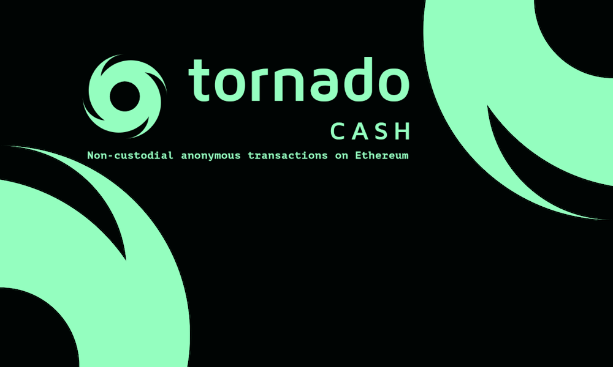
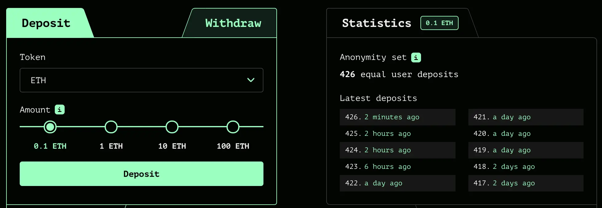
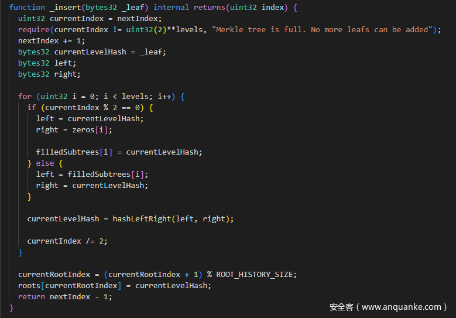
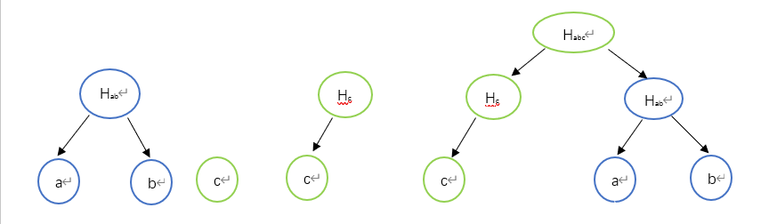
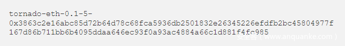
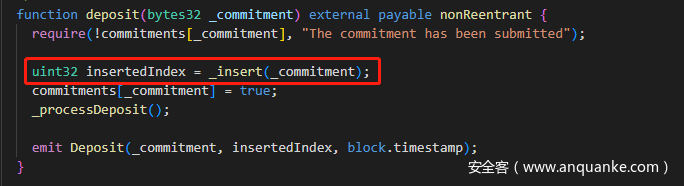
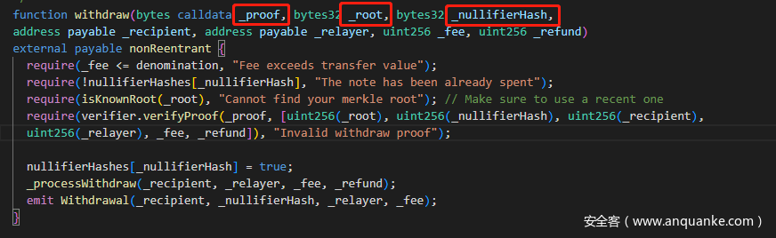
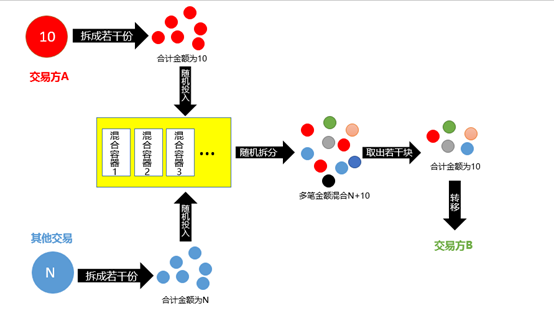
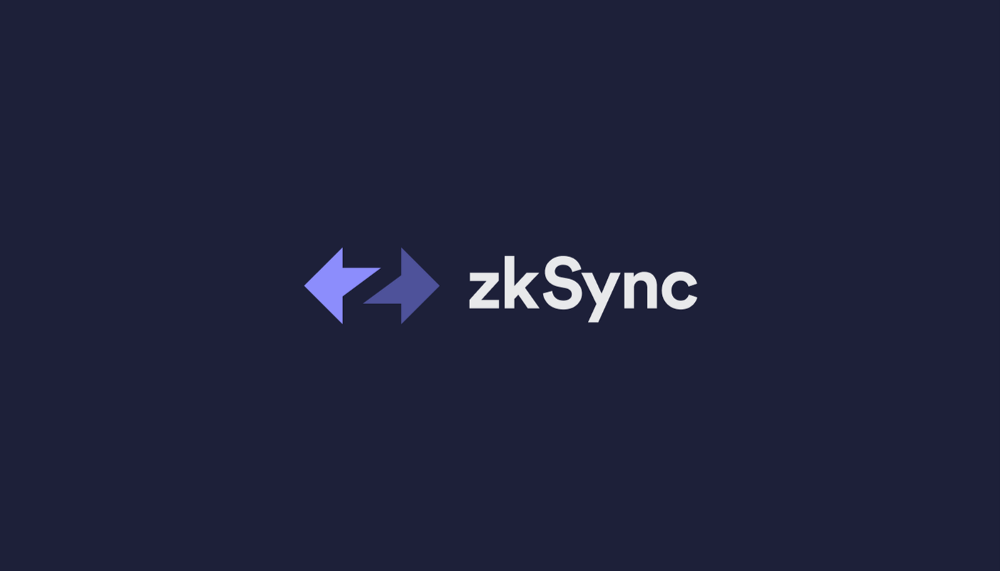
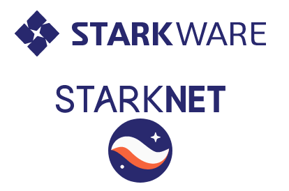

# 采用零知识证明的项目

## 交易隐私

### Tornado cash 混币器

*算法：zk-SNARKs*

#### 背景

Tornado cash 是一个去中心化**加密货币混合**服务平台，使用智能合约来接受来自一个地址的代币存款，并允许他们从另一个地址提款。这些智能合约作为混合所有已存资产的池。一旦资金通过一个全新的地址从这些池中提取，链上源和目的地之间的链接已断开。然后将提取的加密资产匿名化。tornado cash 中通过将 **merkle tree** 与 **zk-snarks** 结合使用实现存取款地址分离，从而实现匿名传送代币。

#### 使用

Tornado cash 允许你将固定金额的 ETH、DAI、USDC、USDT 存入合约。存款时会得到一个备份代码，用于以后提取资金。

- 为什么用固定金额？

固定金额容易混入更大匿名集。如图有426份 0.1 ETH 的存款，你存入 0.1 ETH 后就成为了427分之一。

- 如何保障安全（不被追踪）？

安全性取决于你所处匿名集的大小和存提款频率。匿名集越大，存提款越频繁越安全。如果你有一个30,000人的集合，但几个月没有存款/提款。现在你来存款，等了一天又取款，要追踪资金到你身上将是非常容易的。

#### 技术

**对merkle tree的使用：**

主要用于存取款操作，进行存款操作时会创建两个随机数，将这两个随机数通过 `Pedersen` 哈希处理后生成一个字符串 `commitment`，将此字符串作为叶子节点插入默克尔树中，计算出 merkle 根的值后将 merkle 根返回给用户，作为之后取款时的验证凭证。

tornado cash 中的 merkle tree 是一颗二叉树，阅读其代码可知，re-hashing 操作的次数控制在 log(n) 以内，当原始树中叶子节点个数是奇数时插入后的树没有孤儿，原始树中叶子节点个数时偶数时插入后的树有孤儿，孤儿在第一个数据块。

如下图所示，原始树中有两个叶子节点 a，b，当插入新节点 c 时，判断叶子节点个数，为偶数，c 与0值进行 hash 计算得到 `Hc`，叶子节点个数除2，得到叶子节点的父节点个数1，判断节点个数为奇数，将 `Hc` 与 `Hab` 连接并计算 hash 值 `Habc` ，此时 `Habc` 为这颗 merkle 树的根，用户将这个根保存作为之后取款的凭证。

**对zk-snarks的使用：**

tornado cash 中取款操作需要用户提供一个 note，如下图

这个 note 是由 `secret` 与 `nullifier` 通过 zk-snarks 电路在链下计算生成的，`secret` 与 `nullifer` 是在链下随机生成的31字节长度的随机数。

tornado 中，存款操作传入的参数 `commitment` 是由 `secert` 与 `nullifer` 串联产生一个62字节的数，通过`Pedersen` 哈希处理，生成的输出表示 `Baby Jubjub` 椭圆曲线的一个元素，编码为 32 字节大端整数。之后将 `commitment` 插入 merkle 树中得到 `merkle root`。

在 tornado cash 中，取款操作时需要输入三个值，分别是 `proof`，`root`，`nulifierHash`，`proof` 为存款时在链下计算出的 note 值，`root` 为存款时获得的 merkle root，`nulifierHash` 为生成的随机数。

`nulifierHash`作用是为了防止已经使用过的 note 再次使用，在进行证明 `proof` 之前，先确定传入的 `root` 值是否在 merkle 树中，之后验证 `proof` 是否正确，通过电路计算出一个 `root`，将计算出的 `root` 与取款时输入的 `root` 比较是否一样，一样的话，将 `nullifierHash` 记录为 true，证明我们已经领过款。

#### 总结

tornado cash 中将 merkle tree 运用到零知识证明中，零知识证明中 `proof` 实际捆绑了凭证 note，用户自己的 `merkle root`，`nullifierHash`，资金接收者地址。取款合约中确保 `nullilierHash` 是未使用过的，以及用户提供的 Root 确实是自己知道的代表完整记录的 Root。然后，合约将自己验证过的输入 `nullifierHash` 和 `root`，以及用户方输入的 `proof recipient fee` 等输入 Verifier 合约。用零知识证明 `proof` 提供的路径确实能联通用户提供的 `nullifier` 和 `secret` 生成的 `commitment` 和提供的 `root`，用户是这个 `commitment` 的拥有者。

> 由于政策监管，Tornado Cash 现已被封杀停止使用，一代天王就此陨落...

### Zcash 匿名币

*算法：zk-SNARKs*

#### 背景

Zcash 诞生很早，代码是基于比特币改的，差异主要体现在两者匿名性。Zcash 隐藏了交易者的信息，包括交易双方的地址和交易金额，难以追溯交易链。匿名版的 UTXO

#### 使用

交易转账时，发送方的币会先进入混币器，与其他交易来源的币混合在一起，然后随机拆分出对应金额，发送给接收方。交易记录不公开，通过密钥可查交易记录。

#### 技术

Zcash 的发展大体经过了 OverWinter -> Sprout -> Sapling 这几个阶段，随着业务和功能的逐渐丰富，密钥系统也越来越复杂。

现在 Zcash 的交易结构十分复杂，具体可参考 [Zcash 图解Transaction结构](https://learnblockchain.cn/2019/08/01/nullifier-hash)

#### 如何实现隐私

所谓隐私，就是要隐藏一笔交易的发送方(from)、接收方(to)、金额(amount)

- 隐藏发送方

发送方可以随机生成密钥对，然后对交易签名，这样就不会对外暴露固定的公钥。

- 隐藏接收方

接收方的Payment Address只有发送方知道，广播时对信息进行处理，矿工无法知晓地址信息，且无法在区块链浏览器中查询；引入了“多样化”地址，可以给每个发送方生成不同的地址，从而混淆接收方的信息。

- 隐藏金额

矿工只需要通过零知识证明验证交易的input和output是平衡的，而不需要查询发送方的余额以及转账金额。

## 以太坊扩容

> 随着以太坊链上活动越来越多，导致越来越堵，为了保证 L1 的 *安全性* 和 *去中心化*，以太坊转向了一条以 Rollup 为中心的扩容路线。

把我们今天在以太坊上进行的大部分交易执行(DeFi、NFTs 等)都转移到 Rollup 上进行，而不是在以太坊 L1 本身；Rollup 继承了以太坊 L1 的安全性，且由于以太坊 L1 处理了最困难的部分，Rollups 得以专注成为最好的执行层。

### zk Rollup

> Optimism 和 Arbitrum 二者都是基于 *Optimistic Rollup* 技术的 Rollup 网络；另一类 Rollup 网络则是基于 *ZK-Rollup* 技术，如 zkSync 和 StarkNet

由于 Optimistic Rollup 要提高资本效率就一定会降低安全性，所以 ZK-Rollup 更吸引流动性提供者。

ZR比OR更难，但长远来看，若零知识证明能够实现对于一般交易有效的生成证明的突破，ZR的优势更巨大。

#### zkSync

*算法：zk-Snark*

##### 背景

备受瞩目的以太坊 L2，主网 1.0 已发布，2.0 即将发布

##### 使用

体验上同以太坊，只是交易速度更快，手续费更低。创新点是支持 ERC20 代币支付手续费，也就是说账户里没有以太币也可以发起交易。

##### 技术

zkSync的电路设计很有意思。众所周知，一个区块中会打包不同的交易，如果只是针对一个个交易进行电路的证明，电路大小会变化。zkSync将交易切割成更小的“通用电路“。一个区块中包含固定的”通用电路“，间接支持多个交易。交易证明基于 Plonk 证明系统。

代码设计可以参考 [zkSync源代码导读](https://learnblockchain.cn/article/1642)

电路设计可以参考 [深入理解zkSync电路](https://learnblockchain.cn/article/1807)

#### StarkNet

*算法：zk-Stark*

##### 背景

明星团队，由世界级密码学家和科学家组成。核心成员是 Zcash 的前 CTO 。多年零知识证明领域研究。

##### 技术

Stark 不如 Snark 成熟，且难与 EVM 兼容。StarkWare 创建了新的 Cairo 语言。

StarkNet 技术解读资料太少了，要研究可能主要参考 zk-Stark 和项目官网吧 🥲

### zkEVM

> 零知识证明与EVM的结合

各方面都有重大意义：

- 对于 Rollup 扩容：zkEVM 可以为批量交易生成证明从而在主网快速验证
- 对于 Dapp 开发者：无需学习 zk 硬核知识或新的编程语言就可以编写有 zk 属性的合约
- 对于 zkEVM 开发者：无需为网络上的合约编写不同电路逻辑，而是仅需维护 zkEVM

Polygon、zkSync、StarkNet 都是这方面的明星项目。

各种 zkEVM 可参考 [清晰理解zkEVM、EVM 兼容性和Rollup](https://learnblockchain.cn/article/4596)
